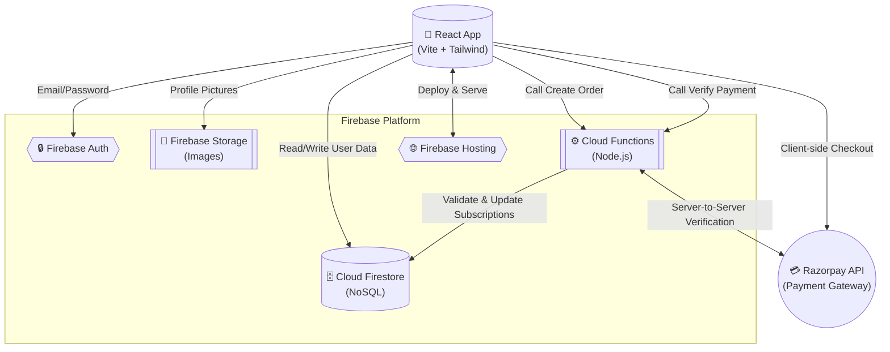
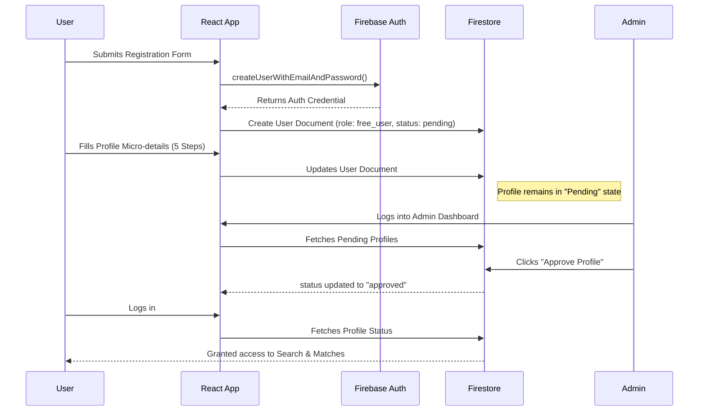
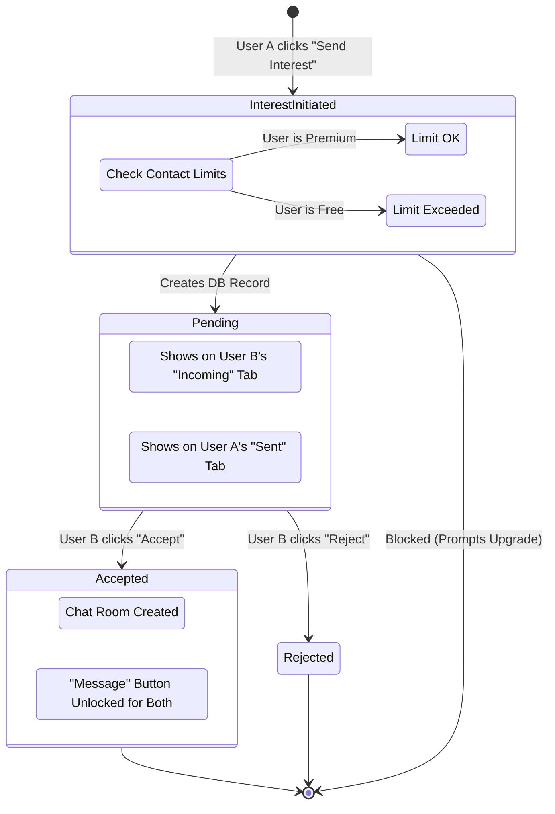
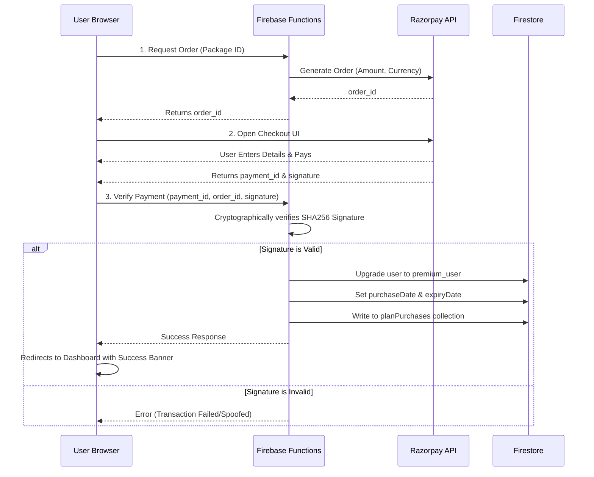

# Suvira Matrimony System Diagrams

The following diagrams illustrate the core architectural and functional workflows of the Suvira Matrimony platform.

---

## 1. High-Level System Architecture

This diagram shows how the React frontend interacts with the Firebase Ecosystem and Razorpay for serverless operations.

---

## 2. User Onboarding & Profile Lifecycle

This flowchart describes the journey a user takes from first visiting the site to getting their profile approved by an admin.

---

## 3. Interest & Match Workflow

This diagram outlines what happens when a user attempts to send an interest to a potential match, including validation limits and the acceptance flow.

---

## 4. Payment & Subscription Processing

This sequence demonstrates the secure transaction flow preventing spoofing or client-side manipulation of payment success.

