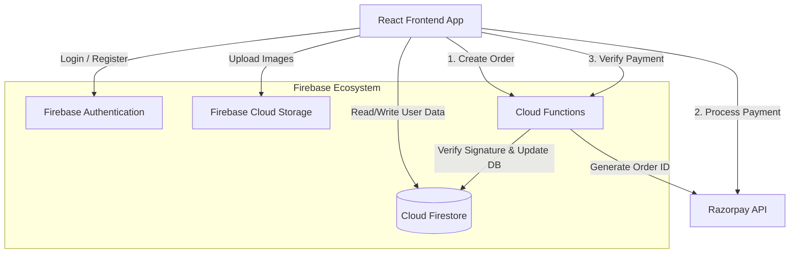

# Suvira Matrimony - System Documentation

Welcome to the comprehensive system documentation for the **Suvira Matrimony** application. This document details the technology stack, system architecture, user journey, and administrative capabilities.

---

## 1. Technology Stack

The platform is built using modern, scalable, and serverless technologies.

### Frontend
- **Framework**: React.js (Vite)
- **Styling**: Tailwind CSS, Framer Motion (for animations)
- **Routing**: React Router DOM (v6)
- **Icons**: React Icons (FontAwesome)

### Backend & Infrastructure (Firebase)
- **Authentication**: Firebase Auth (Email/Password)
- **Database**: Cloud Firestore (NoSQL Document Database)
- **Storage**: Firebase Storage (Profile Image uploads)
- **Backend Logic**: Firebase Cloud Functions (Node.js for Payment Processing)
- **Hosting**: Firebase Hosting

### Third-Party Integrations
- **Payment Gateway**: Razorpay (for Premium Memberships)

---

## 2. System Architecture & Workflow Design

The system relies on a serverless architecture where the React frontend communicates directly with Firebase services for most operations, utilizing Cloud Functions only for secure, server-side tasks like payment verification.

### Data Modeling (Key Collections)
- **`users`**: Stores user profiles, preferences, stats (profile views, matches), and subscription status.
- **`interests`**: Tracks sent interests (senderId, receiverId, status: `pending`, `accepted`, `rejected`).
- **`chats` & `messages`**: Stores real-time conversations between matched users.
- **`packages` & `planPurchases`**: Stores available premium tiers and logs of user transactions.

---

## 3. User Journey & Workflows (Micro Details)

### 3.1 Account Creation & Registration
1. **Sign Up**: The user registers using an Email and Password. Firebase Auth creates the user credentials.
2. **Initial Document**: A listener automatically creates a Firestore document in the `users` collection with default values (`role: 'free_user'`, `profileStatus: 'pending'`).
3. **Email Verification**: User must verify their email address.

### 3.2 Profile Completion
A completed profile is required to fully utilize the platform.
1. **Multi-step Form**: Users fill out micro-details across tabs:
   - **Personal**: Name, Age, Gender, Religion, Caste, Location, Physical Attributes (Height, Weight, Blood Group).
   - **Family**: Father/Mother occupation, Siblings, Family Type/Values.
   - **Education & Career**: Highest Degree, Occupation, Annual Income.
   - **Lifestyle**: Dietary habits, Smoking/Drinking preferences, Profile Photo upload (saved to Firebase Storage).
   - **Partner Preferences**: Desired age range, height, religion, education, etc.
2. **Admin Review**: Once submitted, the profile enters a `pending` state. The user's Dashboard shows a "Pending Review" badge until an Admin approves it.

### 3.3 Matches & Discovery
- **Opposite Gender Engine**: The search and suggested matches algorithms strictly filter by opposite gender. 
- **Filtering**: Users can filter the database using complex queries (Age, Religion, Caste, Income).

### 3.4 The Interest System
1. **Sending an Interest**: User A clicks "Send Interest" on User B's profile. 
   - A `pending` record is created in the `interests` collection.
   - A contact usage check ensures User A has not exceeded their weekly contact limit (based on their premium plan).
2. **Managing Interests (My Interests Page)**: 
   - **Incoming Tab**: User B sees the request and can click **Accept** or **Reject**.
   - **Sent Tab**: User A sees their sent requests waiting for a response.
   - **Accepted Tab**: Aggregates all mutually agreed interests. A **Message** button appears here.
   - **Rejected Tab**: Aggregates declined requests.

### 3.5 Real-Time Chat
- Accessible only if: (1) An interest is Mutual/Accepted, and (2) The user has an active Premium Subscription.
- Messages are stored in Firestore under a unique `chatId` combined from both users' IDs, ensuring a secure, private room.

### 3.6 Purchasing Premium Packages
The system offers multiple tiers (Remarriage, Platinum, Gold, NRI).
1. **Initiation**: User selects a plan. Frontend calls `createRazorpayOrderHttp` Cloud Function to securely generate a Razorpay Order ID.
2. **Checkout**: Razorpay modal opens. User completes the transaction via UPI, Card, etc.
3. **Verification**: Frontend sends the payment signature to the `verifyRazorpayPaymentHttp` Cloud Function. 
4. **Fulfillment**: The Cloud Function verifies the cryptographic signature. Upon success, it upgrades the user's Firestore document to `premium_user`, setting the `purchaseDate` and `expiryDate`, and applying weekly contact limits.

---

## 4. Admin Functionality & Dashboard

The platform includes a protected `/admin` route accessible only to users with `role: 'admin'`. It provides micro-control over the entire ecosystem.

### 4.1 Admin Login & Security
- Admin routes are protected by a higher-order component (`AdminRoute`). It intercepts navigation and checks the `userProfile.role`. If not 'admin', it redirects to the homepage.

### 4.2 Dashboard Analytics
- **High-Level Metrics**: Displays Total Users, Active Subscriptions, Total Revenue (calculated from `planPurchases`), and Total Interests Sent.
- **Recent Activity**: Real-time feed of the newest registrations.

### 4.3 User Management (`/admin/users`)
- **Grid/Table View**: Search, sort, and filter users by status or email.
- **Profile Moderation**: Admins can view a user's detailed profile and manually **Approve** or **Reject** them. (Only approved users are visible in public searches).
- **Deletion**: Complete removal of abusive or requested accounts.

### 4.4 Premium & Subscription Management (`/admin/premium`)
- **Manual Upgrades**: If a user pays offline or via wire transfer, the Admin can manually activate any package (e.g., Gold, NRI) directly from the dashboard.
- **Extensions**: Admins can extend a user's expiry date by a custom number of months.
- **Revocation**: Admins can immediately expire or cancel a user's premium status, reverting them to a `free_user`.

### 4.5 Interest Monitoring (`/admin/interests`)
- **Global View**: Admins can see all interactions occurring on the platform (Who sent an interest to Whom, and the current status).
- **Spam Detection**: The system tracks how many interests a user sends. If a user acts like a bot or sends excessive requests rapidly, they are flagged for Admin review. Admins can then take action to warn or ban the user.
